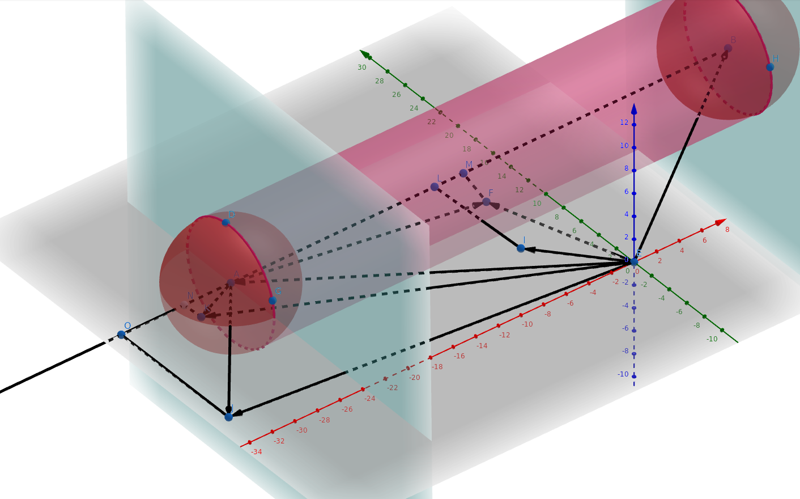
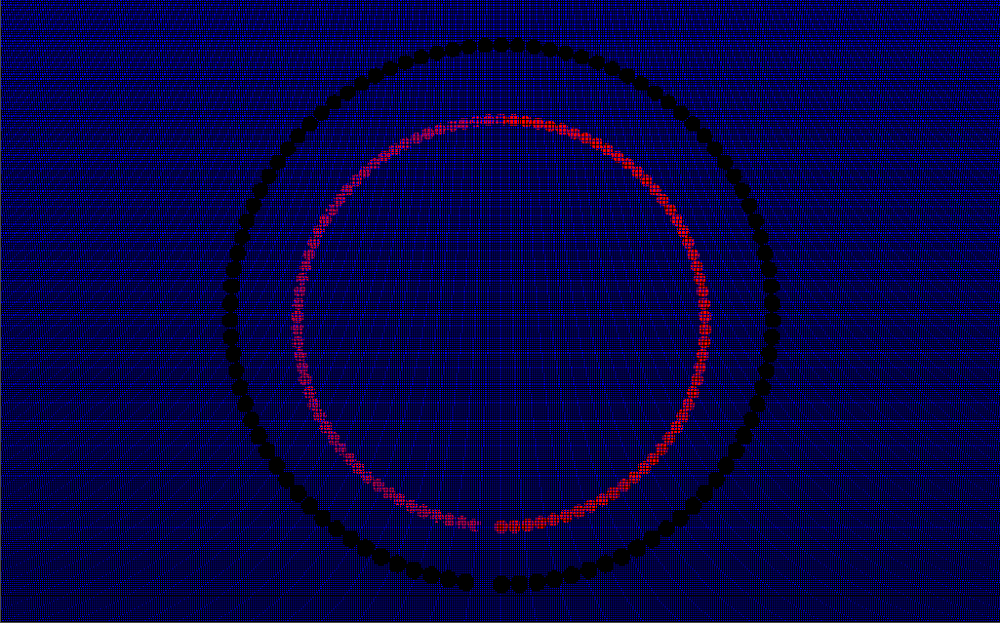
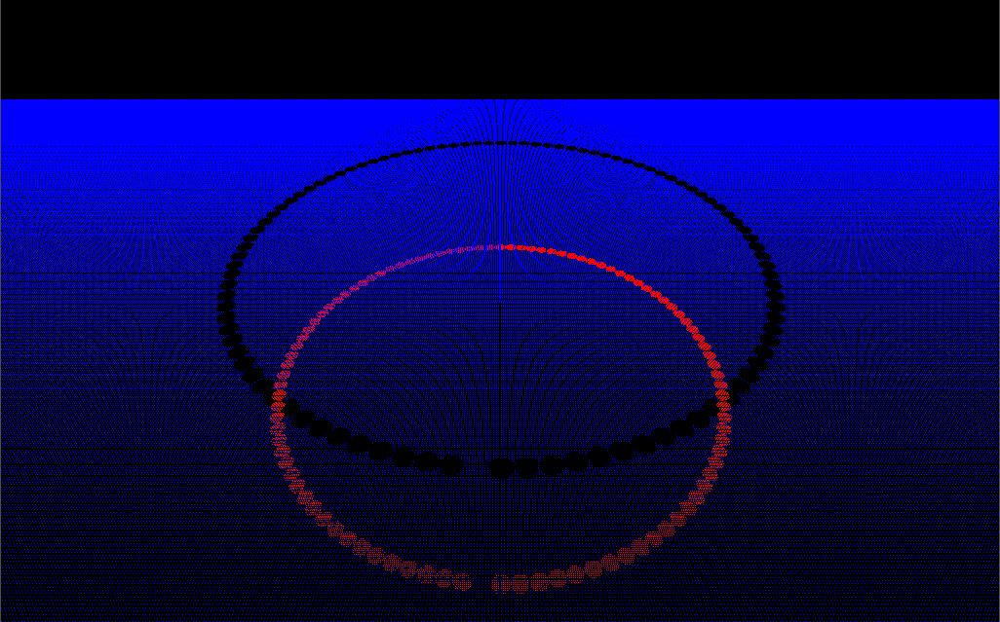
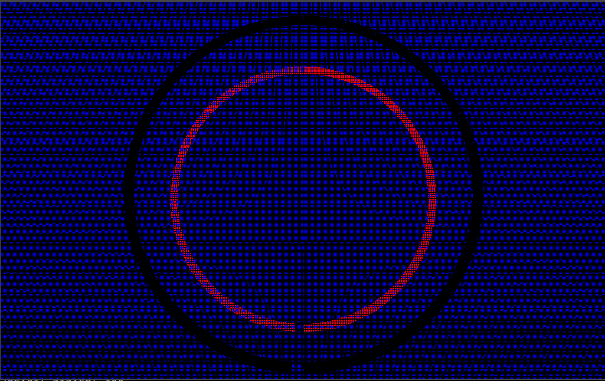
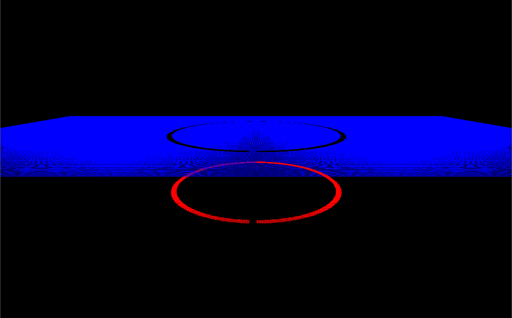
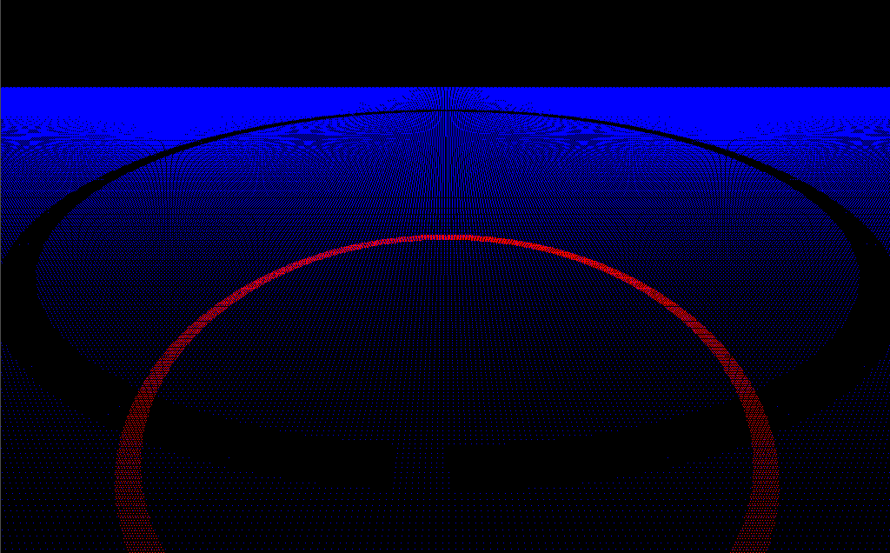
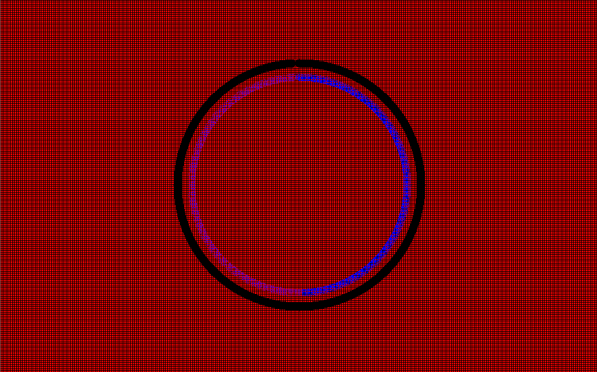
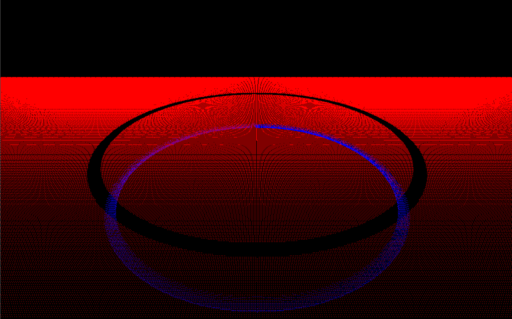
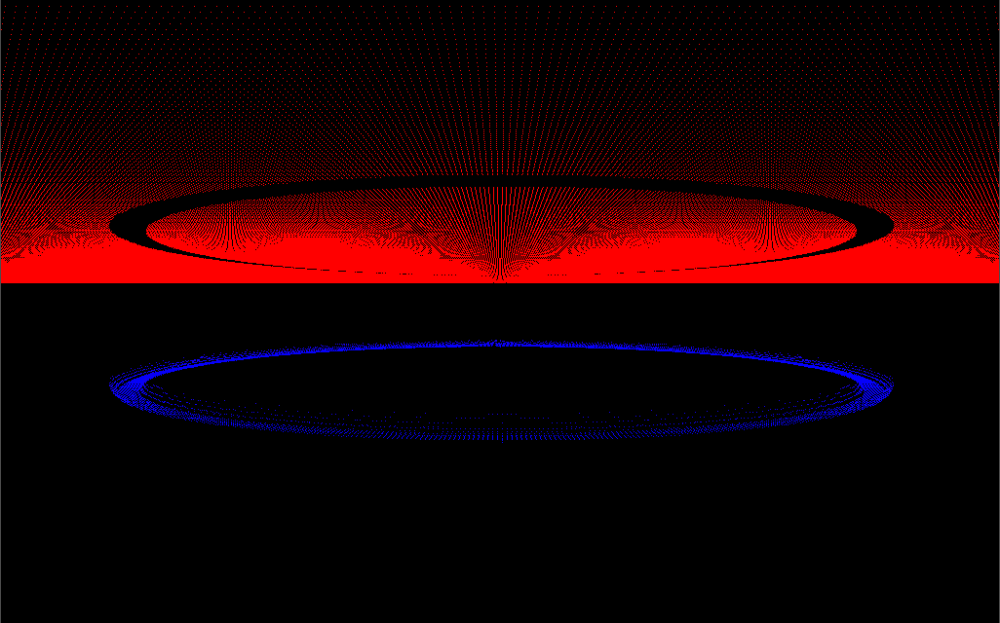

# This is documantation for test task.

## Notes on run on Linux

1)`cmake CMakeLists.txt`

2)`make`

3)`./test_task`

## Mathematical approach
There is a cylinder with spherical caps.
It perfectly imitates the linear motion of a sphere.
To understand what the cylinder is cutting out - you need to check each cap individually, which means you just need to check the occurrence of the test point in each of the spheres.
To understand that a point inside a sphere or outside of it is enough to know the length of the vector from its center to the test point and compare this length with the radius of the sphere.
In the case of a cylinder (no caps, we have already dealt with them) you can first find out whether the point lies in the plane perpendicular to the cylinder axis and if it is inside such a plane - check the length of perpendicular from the test point to the cylinder axis.

So, there example of testing 4 points (I, F, J, K) on intersection with sphere move from point A to point B.
First check with sphere at center A really easy. Just find vectors AI, AF, AJ, AK and compare with sphere radius.
Then the same with BI, BF, BJ, BK.
After that check test if point between 2 parallel planes perpendicular to AB (cylinder axis).
It's calculating by dot product of AI, AF, AJ, AK and AB and comparing with length of AB.
If point in this gap - check length of perpendicular between AB and point.
There left only I and F in gap, so last step - check distance. IL > sphere radius and FM <= sphere radius, so only F lies in cylinder.
 
## Problematics of discrete step

The main problem in discrete step is approximation of intermediate state between steps.
Ideal case is just use infinite amount of steps and get perfect skin.
But we are limited with machines resources and we can use only small number of sphere positions.
And there are 2 approaches for solving problem with discrete step:

1.Assume that step infinitely small (or just small enough to satisfy precision) and approximate sphere moment with linear motion;

2.Use torus and cylinder because all movement could be described as linear and circular movement.

At first glance second approach better, because we can get really good approximation of movement.
But there are a lot of additional problems in comparison to first approach.
For example, determining point in specific sector of a torus is very hard computationally, finding rotation angle or other cases.

So, first approach good enough for this particular task.
I'ts not enough to use only spheres or only cylinders with plain caps because of we will get a lot of points, that shouldn't be there.
Linear motion of a sphere could be represent as set of linked cylinders with spherical caps.
And determining if point inside a sphere or cylinder pretty easy task.

## There are some illustrations:

### As you see only spheres are bad idea.

### Cylinders without caps are much better, but there are still problems with excess points.

### Cylinders with caps are really good.
